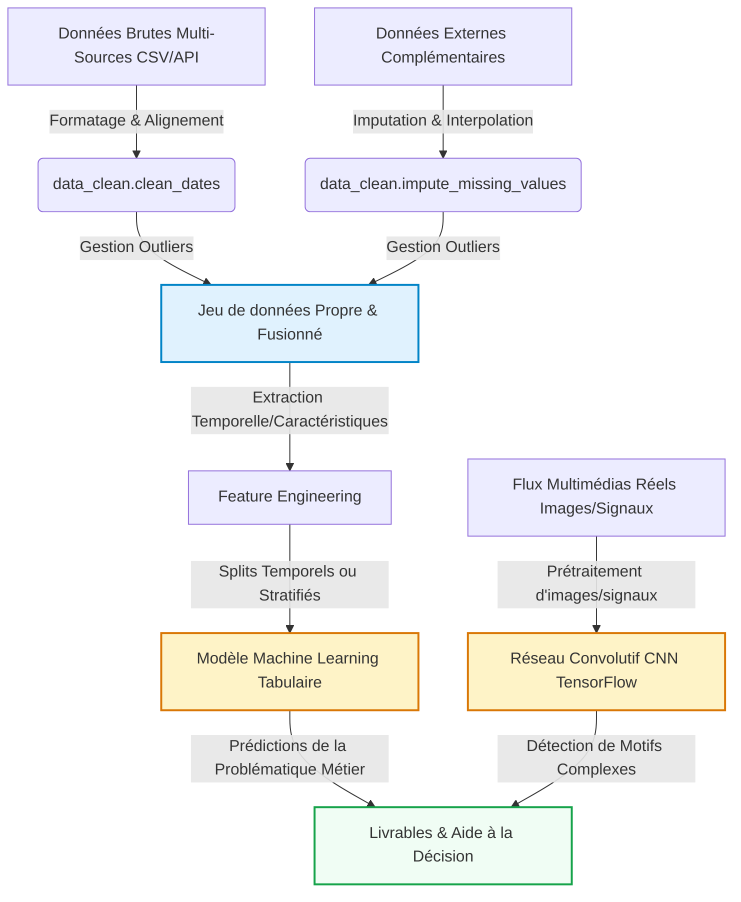

# Introduction et Contexte Métier {#sec-intro}

[](https://github.com/nassJs/aptispace-datascience-projet/actions/workflows/ci.yml)

## Contexte du Projet

**Quels sont les objectifs globaux et le domaine d'étude de votre projet ?**

Ce projet s'inscrit dans le domaine de l'**éducation augmentée par l'intelligence artificielle**. L'objectif global est d'analyser les comportements et les performances de 50 000 étudiants issus de cinq filières académiques (
STEM, Business, Humanités, Médecine, Arts) dans leur rapport à l'IA générative au cours d'un semestre. Il s'agit d'établir un **profil moyen de l'étudiant contemporain** qui intègre l'IA dans ses pratiques d'apprentissage, en croisant des indicateurs de performance académique (GPA), d'usage de l'IA (heures hebdomadaires, cas d'usage, niveau de maîtrise des prompts) et de bien-être (anxiété, risque de burnout, dépendance perçue).

**En quoi ce sujet de recherche est-il pertinent et stratégique ?**

L'intégration massive des outils d'IA générative dans les cursus universitaires constitue un tournant majeur pour l'enseignement supérieur. 
Comprendre si et comment l'IA améliore réellement les performances académiques — ou au contraire génère de la dépendance et du burnout — est une question stratégique pour les établissements, 
les enseignants et les décideurs politiques. Ce dataset, qui couvre des contextes institutionnels variés (interdiction stricte, autorisation avec citation, encouragement actif), 
permet d'évaluer l'efficacité des différentes politiques adoptées face à l'essor des outils comme ChatGPT ou GitHub Copilot. La pertinence de ce sujet est renforcée par l'absence de consensus scientifique actuel sur l'impact réel de l'IA sur l'apprentissage à long terme.

**Pourquoi l'analyse quantitative de ce jeu de données est-elle indispensable pour répondre à votre problématique ?**

Face à la diversité des profils étudiants et des contextes d'usage, seule une approche quantitative portant sur un large échantillon (50 000 observations, 16 variables) permet de dégager des tendances robustes et généralisables. L'analyse statistique et les modèles prédictifs permettent de mesurer précisément l'impact de chaque facteur (heures d'utilisation, politique institutionnelle, niveau de compétence en prompt engineering) sur les deux variables cibles : le **GPA post-semestriel** et le **niveau de risque de burnout**. Sans cette rigueur quantitative, il serait impossible de distinguer les effets bénéfiques de l'IA des effets néfastes, ni d'identifier les profils d'étudiants les plus vulnérables.

## Objectif Analytique

Ce projet poursuit deux tâches de modélisation complémentaires :

1. **Régression supervisée** — prédire le GPA post-semestriel (`Post_Semester_GPA`) à partir des comportements d'usage de l'IA et des caractéristiques académiques de l'étudiant. Le modèle principal retenu est un **Random Forest Regressor** (100 estimateurs), évalué via RMSE et R².

2. **Classification supervisée** — prédire le niveau de risque de burnout (`Burnout_Risk_Level` : Low / Medium / High) en exploitant les mêmes variables explicatives, évalué via F1-score macro et accuracy.

Les variables explicatives retenues couvrent trois dimensions : **usage de l'IA** (heures hebdomadaires, diversité des outils, niveau de maîtrise des prompts, dépendance perçue), **habitudes d'étude** (heures d'étude traditionnelles, rétention des acquis, politique institutionnelle) et **bien-être** (anxiété aux examens, GPA pré-semestre).

Le jeu de données (50 000 observations, 16 variables brutes) est enrichi lors du feature engineering par des variables dérivées clés : `AI_Usage_Level` (catégorisation de l'intensité d'usage IA), `GPA_Squared` (terme quadratique pour capturer les effets non-linéaires), ainsi que des indicateurs sectoriels externes (`Secteur_IA_Adoption_Rate`, `Avg_Salary_Index`).

Les livrables analytiques sont : un modèle de prédiction du GPA mobilisable pour l'orientation académique, un modèle de détection précoce du burnout, et un dashboard interactif Streamlit permettant aux établissements d'identifier les profils d'étudiants à risque et d'évaluer l'efficacité de leurs politiques d'encadrement de l'IA.

---

# Acquisition et Préparation des Données (Data Wrangling) {#sec-wrangling}

Le succès de tout projet de Data Science repose sur la qualité de la préparation des données [@pandas2020]. Cette section documente l'audit de qualité et les étapes de nettoyage appliquées à vos jeux de données bruts.

## Chapitre 1 : Acquisition Multi-Sources


## Chapitre 2 : Nettoyage et Préparation (Wrangling)


---

# Visualisation Multidimensionnelle (Insights) {#sec-viz}

Nous présentons ici les résultats visuels clés permettant de dégager des insights exploitables pour les décideurs, en s'appuyant sur notre module `src/utils_viz.py`.

## Chapitre 3 : Travaux Pratiques d'Exploration Visuelle


---

# Analyse Exploratoire des Données (EDA) {#sec-eda}

Dans cette section, nous analysons les relations statistiques fondamentales qui régissent votre domaine d'étude au sein du jeu de données.

## Chapitre 4 : Travaux Pratiques d'Exploration (EDA)


---

# Modélisation et Apprentissage {#sec-modelling}

Le pipeline complet intègre à la fois la branche analytique tabulaire (Machine Learning) et la branche d'analyse visuelle ou de signaux complexes (Deep Learning CNN) :



## Chapitre 5 : Travaux Pratiques de Modélisation (ML & DL)


---

# Évaluation Métrique et Validation {#sec-evaluation}

## Chapitre 6 : Travaux Pratiques d'Évaluation & Robustesse


---

# Data Storytelling et Communication {#sec-storytelling}

## Chapitre 7 : Travaux Pratiques de Storytelling


## Présentation des Résultats (Livrables Interactifs)

::: {.panel-tabset}

### 📺 Diaporama de Soutenance (RevealJS)
Ci-dessous est intégré le squelette de votre diaporama de soutenance RevealJS. Utilisez-le pour présenter votre démarche aux décideurs de façon professionnelle.

<iframe src="slides.html" width="100%" height="500px" style="border: 1px solid #e2e8f0; border-radius: 8px; background: white;"></iframe>

### 📊 Exemple de Dashboard Dynamique (OJS / Plotly)
::: {.content-visible unless-format="pdf"}
Voici un exemple minimal de code montrant comment intégrer un graphique dynamique contrôlé par un composant d'interface utilisateur en Observable JS (OJS).

```{ojs}
//| echo: true
// Boutons de sélection interactifs OJS
viewof selectedCategory = Inputs.select(["Toutes", "A", "B", "C"], {value: "Toutes", label: "Filtrer par Catégorie :"})
```

```{ojs}
//| echo: false
// Données simulées réactives
data = [
  {timestamp: "2026-05-18T00:00:00Z", value: 10.5, category: "A"},
  {timestamp: "2026-05-18T02:00:00Z", value: 12.1, category: "A"},
  {timestamp: "2026-05-18T04:00:00Z", value: 14.7, category: "A"},
  {timestamp: "2026-05-18T05:00:00Z", value: 15.2, category: "A"},
  {timestamp: "2026-05-18T06:00:00Z", value: 16.0, category: "B"},
  {timestamp: "2026-05-18T07:00:00Z", value: 18.3, category: "B"},
  {timestamp: "2026-05-18T09:00:00Z", value: 21.5, category: "B"},
  {timestamp: "2026-05-18T10:00:00Z", value: 22.0, category: "B"},
  {timestamp: "2026-05-18T12:00:00Z", value: 25.4, category: "C"},
  {timestamp: "2026-05-18T13:00:00Z", value: 26.1, category: "C"},
  {timestamp: "2026-05-18T15:00:00Z", value: 28.9, category: "C"},
  {timestamp: "2026-05-18T16:00:00Z", value: 30.2, category: "C"}
]

// Filtrage réactif de la donnée
filteredData = selectedCategory === "Toutes" 
  ? data 
  : data.filter(d => d.category === selectedCategory)

// Tracé interactif avec la librairie Plotly
Plotly.newPlot('dynamic-chart', [{
  x: filteredData.map(d => d.timestamp),
  y: filteredData.map(d => d.value),
  type: 'scatter',
  mode: 'lines+markers',
  marker: {color: '#1A73E8', size: 8},
  line: {shape: 'spline', color: '#1A73E8', width: 3}
}], {
  title: 'Évolution Dynamique des Valeurs (Filtrée)',
  margin: {t: 50, b: 50, l: 50, r: 50},
  paper_bgcolor: 'rgba(0,0,0,0)',
  plot_bgcolor: 'rgba(0,0,0,0)',
  xaxis: {gridcolor: '#E5E7EB'},
  yaxis: {gridcolor: '#E5E7EB'}
})
```

::: {#dynamic-chart style="width:100%; height:400px; background: white; border-radius: 8px; box-shadow: 0 4px 6px -1px rgba(0,0,0,0.1);"}
:::
:::

:::

---

# Dashboard Interactif (Streamlit) {#sec-dashboard}

En complément des analyses statiques présentées dans ce rapport, un **dashboard interactif** a été développé avec la librairie Streamlit. Il permet d'explorer dynamiquement les résultats sans nécessiter de compétences en programmation.

## Contenu du Dashboard

Le dashboard (`app.py`) présente les éléments suivants :

- **KPIs globaux** : nombre d'étudiants analysés, nombre de variables, usage IA moyen hebdomadaire, GPA moyen post-semestriel
- **Lecture rapide des résultats** : évolution du GPA entre début et fin de semestre, filière la plus exposée à l'IA, niveau de burnout le plus fréquent
- **Visualisations** : distribution de l'usage IA, usage moyen par filière, relation burnout / usage IA, évolution du GPA avant/après semestre
- **Indices de dépendance et diversité** : score moyen de dépendance perçue aux outils IA, nombre moyen d'outils IA utilisés
- **Corrélations** : top 5 des variables les plus corrélées au GPA final
- **Aperçu du dataset** brut (15 premières lignes)

## Lancer le Dashboard

### Prérequis

```bash
# Créer et activer l'environnement virtuel (première fois)
python -m venv venv
source venv/bin/activate        # macOS / Linux
# venv\Scripts\activate         # Windows

# Installer les dépendances
pip install -r requirements.txt
pip install streamlit
```

### Démarrage

```bash
# Depuis la racine du projet
source venv/bin/activate
streamlit run app.py
```

L'application s'ouvre automatiquement dans le navigateur à l'adresse :

```
http://localhost:8501
```

> **Note** : le fichier de données attendu est `data/raw/ai_student_.csv`. Si Streamlit affiche une erreur `FileNotFoundError`, vérifiez que ce fichier est bien présent à cet emplacement.

## Aperçu de l'Architecture du Dashboard

```
app.py
├── Configuration de la page (st.set_page_config)
├── Chargement des données (pd.read_csv)
├── Section KPIs (4 métriques clés)
├── Section Executive Summary (GPA, filière, burnout)
├── Section Visualisations (4 graphiques matplotlib)
├── Section Dépendance IA (2 métriques)
├── Section Corrélations (top 5 variables → GPA)
└── Aperçu dataset (expander)
```

---

# Utilisation de l'Intelligence Artificielle {#sec-ai}

Dans une démarche de transparence scientifique et académique, cette section détaille la manière dont les outils d'Intelligence Artificielle (IA) générative ont été intégrés tout au long de la réalisation de ce projet.

## Cartographie de l'utilisation de l'IA

| Outil d'IA | Cas d'usage (Pourquoi ?) | Méthode d'utilisation (Comment ?) | Rôle et Validation Humaine |
| :--- | :--- | :--- | :--- |
| **Claude (Anthropic)** | Aide à la rédaction du rapport, structuration des sections analytiques aucun contenu intégré sans compréhension préalable


## Principes de Rigueur et Responsabilité

1. **Responsabilité intellectuelle** : L'équipe assume l'entière responsabilité des analyses, des choix de modèles et des conclusions présentées dans ce rapport.
2. **Lutte contre les hallucinations** : Chaque suggestion technique a fait l'objet d'une validation empirique.
3. **Protection des données** : Aucun jeu de données confidentiel ou sensible n'a été soumis à des modèles tiers en ligne.

---

# Bibliographie {.unnumbered}

::: {#refs}
:::